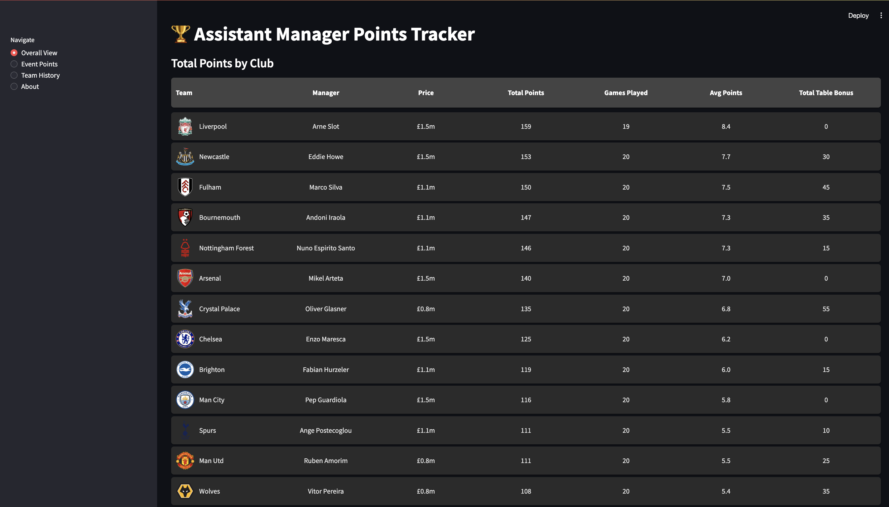
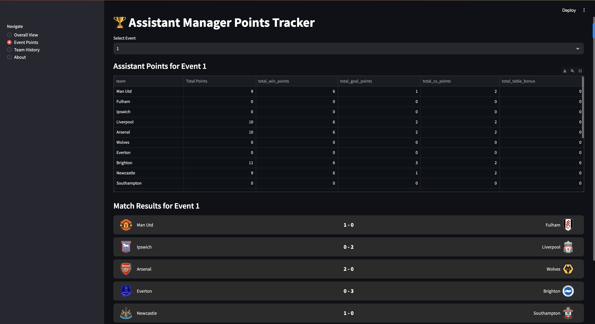
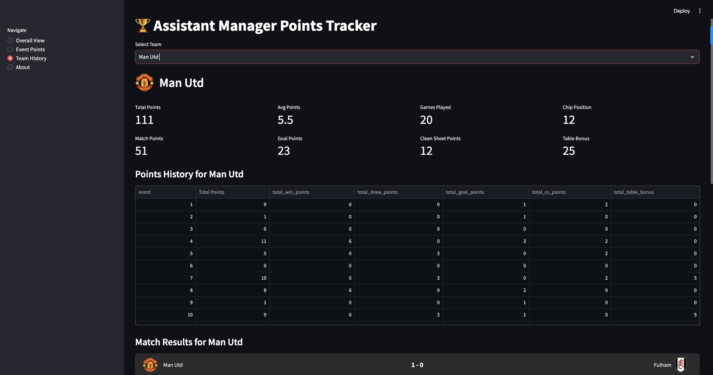

Here's the updated text file content with the added images for the demo section:

---

# ⚽ Assistant Manager Points Tracker

[](./LICENSE)  
  
  
  

## Overview

Deployed Here: https://assistant-manager-chip.streamlit.app/


Assistant Manager Points Tracker is a user-friendly Streamlit web application for tracking and visualizing soccer (football) teams’ performance. It calculates key metrics such as total points, average points, match (win/draw) points, goal points, clean sheet points, and table bonus points. You can also explore game-by-game results and see detailed points history for any team.

**Features**  
- Team History: Quickly see a team’s total points, match points, goal points, and more.  
- Match Results: Browse historical match outcomes for each selected team.  
- Dynamic Points Table: Filter or update data to see real-time results from your CSV/database.  
- Clean & Modern UI: Powered by Streamlit’s columns and metrics for a sleek look.  

## Demo

|                     Demo 1                     |                     Demo 2                     |                     Demo 3                     |
| :-------------------------------------------: | :-------------------------------------------: | :-------------------------------------------: |
|  |  |  |

---

## Installation Steps

1. Clone the repository  
```bash
git clone https://github.com/your-username/assistant_manager_points_tracker.git
```

2. Navigate and install dependencies  
```bash
cd assistant_manager_points_tracker
pip install -r requirements.txt
```

Ensure Python 3.9+ is installed on your system.

3. Run the app  
```bash
streamlit run app.py
```

Open the local URL (e.g., http://localhost:8501) in your browser.

## Usage  

**Data Setup**  
- Place a CSV (e.g., `assistant_manager_points.csv`) in the path expected by the script.  
- Configure a database if dynamic data sourcing is needed.  

**Navigating the App**  
- Home: View clubs, managers, and prices.  
- Team History: Points history, stats, and matches.  
- About: Explanation of metrics and rules.  

**Customization**  
- Update points logic in `app.py` to match league rules.  
- Adjust layout and styling in the code.  

## Contributing  

1. Fork the repository.  
2. Create a new branch:  
```bash
git checkout -b feature-or-bugfix-name
```
3. Commit changes:  
```bash
git commit -m "Add feature or fix bug"
```
4. Push your branch:  
```bash
git push origin feature-or-bugfix-name
```
5. Submit a pull request.  

## License  

This project is licensed under the MIT License.  

---

Let me know if you'd like further assistance!
